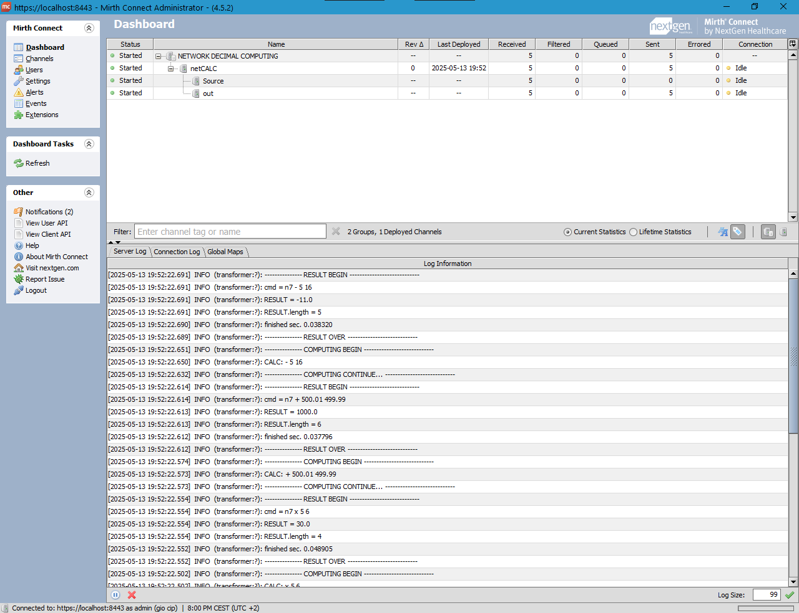
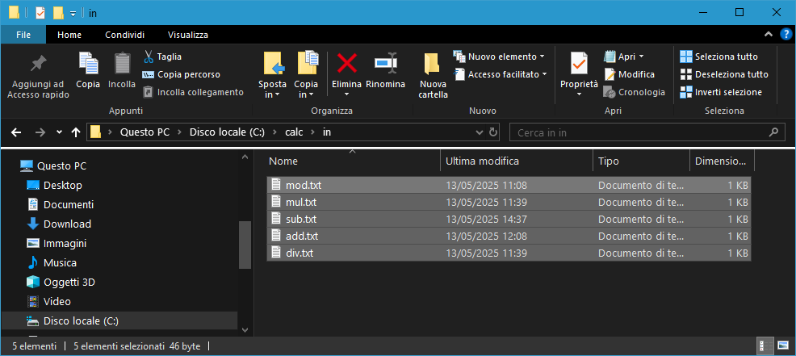
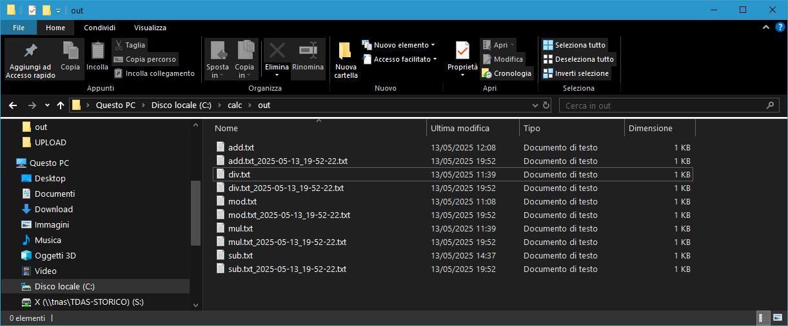

## mirth_netCALC - Network Calculator as Decimal Arithmetic Computing Server 

netCALC is a file server calculator for network workgroups that allow you to perform easily
the 4 standard arithmetic operations (+ - * /) and much more by using simply text files as input.

The arithmetic service is based on n7 CLI calculator (see https://github.com/giocip/n7) and all you need is numeric data list
in a file.txt by operational command as prefix.

ADDITION FILE C:\calc\in\add.txt

     + 500.01 499.99
SUM FILE C:\calc\out\add.txt_2025-05-13_19-52-22.txt contents 1000.0

SUBTRACTION FILE C:\calc\in\sub.txt

     - 5 16
DIFFERENCE FILE C:\calc\out\sub.txt_2025-05-13_19-52-22.txt contents -11.0

MULTIPLICATION FILE C:\calc\in\mul.txt

     x 5 6
PRODUCT FILE C:\calc\out\mul.txt_2025-05-13_19-52-22.txt contents 30.0

DIVISION FILE C:\calc\in\div.txt

     : 5 6
QUOTIENT FILE C:\calc\out\div.txt_2025-05-13_19-52-22.txt contents 0.8333333333333333333333333333333333333333

MODULUS FILE C:\calc\in\mod.txt

     % 5 6
REMAINDER FILE C:\calc\out\mod.txt_2025-05-13_19-52-22.txt contents 5.0

By mirth computing you will see:

